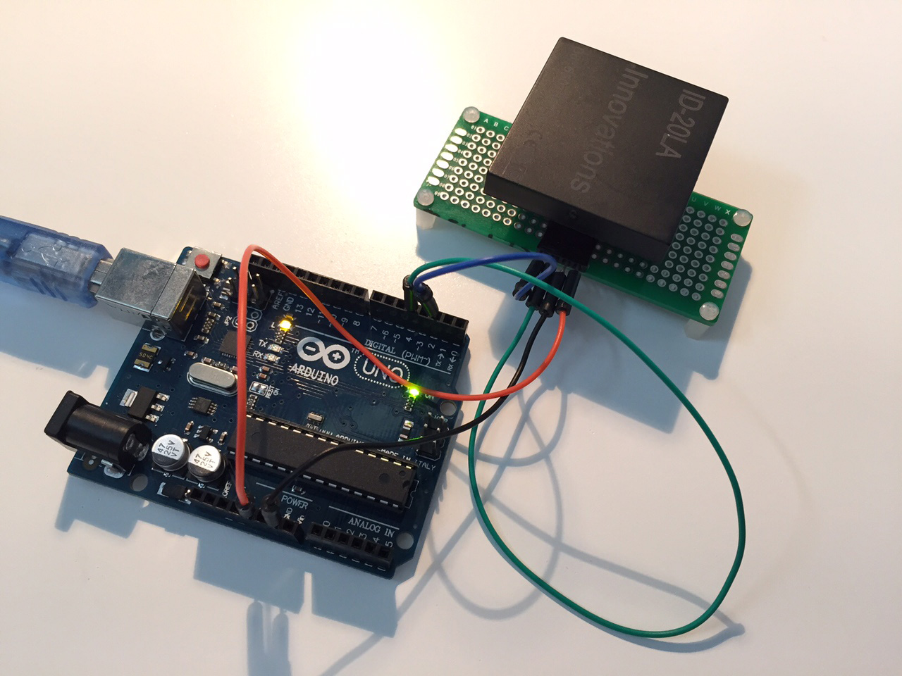
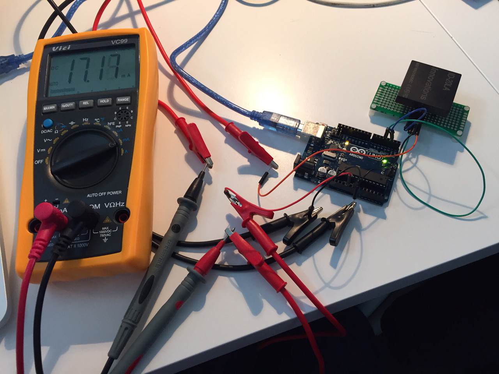

# rfid id innovations test

Read 125 kHz tag with <a href="https://www.sparkfun.com/products/11828" target="_blank">ID-20LA</a> and <a href="https://www.sparkfun.com/products/8419" target="_blank">ID-12</a> modules

<a href="https://raw.githubusercontent.com/jeromedecoster/rfid-id-innovations-test/master/variation-amperes-in-action.mov" target="_blank">in action</a>